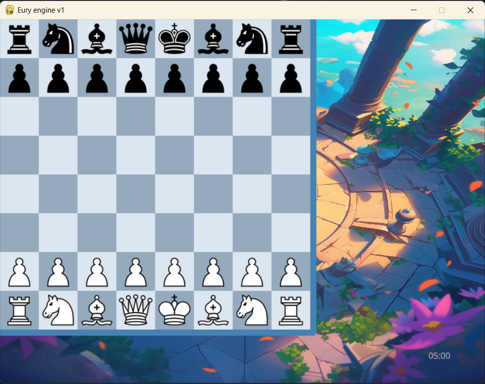

# 🎮 Chess AI - Eury Engine v2.0


**Chess AI với hybrid architecture: C++ engine + Python GUI**

## ✨ What's New in v2.0

🎨 **Completely Refactored UI/UX**

- ✅ Modular component architecture (như Lichess)
- ✅ Fixed clock - chạy đúng với increment support
- ✅ Clean layout - Board centered, sidebar bên phải
- ✅ Better organization - Components tách biệt rõ ràng
- ✅ Smooth animations và visual feedback

📁 **Better Project Organization**

- ✅ Moved all .md files to `docs/` folder
- ✅ GUI components in `src/gui/components/`
- ✅ Clear separation of concerns

## 🚀 Quick Start

### Installation

```bash
# 1. Clone repository
git clone https://github.com/Eurus-Infosec/chess-ai.git
cd chess-ai

# 2. Install dependencies
pip install -r requirements.txt

# 3. Run the NEW refactored version (Recommended)
python -m src.gui.main_window_v2

# Or run the old version
python -m src.gui.main_window
```

## 🎮 Screenshots

### Home Screen


### Game UI (Old)



### Game UI (New v2.0)

- Modern dark theme like Lichess
- Clean component-based layout
- Working clock with increment
- Move history with SAN notation
- Material count visualization

## 🏗️ Architecture

```
Python GUI (Pygame)
├── Components (Modular)
│   ├── BoardWidget - Bàn cờ & interaction
│   ├── ChessClock - Đồng hồ chạy đúng
│   ├── CapturedPieces - Quân bị ăn
│   ├── MoveHistory - Lịch sử SAN
│   └── ControlPanel - Buttons điều khiển
└── C++ Engine (Optional)
    ├── Minimax + Alpha-Beta
    ├── Bitboards
    └── Transposition table
```

## ✨ Key Features

- ♟️ Full chess rules implementation
- 🤖 AI với 4 difficulty levels (Easy to Expert)
- 📖 Opening book support (Polyglot format)
- ⏱️ Multiple time controls (Bullet/Blitz/Rapid/Classical)
- 🎨 Modern Lichess-style interface
- 🔄 Move history với algebraic notation
- 📊 Material count và captured pieces
- ⚡ Multithreaded AI (không lag GUI)
- 🎯 Visual feedback (highlights, arrows)

## 📚 Documentation

All documentation moved to `docs/` folder:

- [README_V2.md](README_V2.md) - Detailed v2.0 documentation
- [HYBRID_ARCHITECTURE.md](docs/HYBRID_ARCHITECTURE.md) - Architecture design
- [GUI_IMPROVEMENTS.md](docs/GUI_IMPROVEMENTS.md) - UI/UX improvements
- [BUILD_GUIDE.md](docs/BUILD_GUIDE.md) - Build C++ engine
- [QUICK_START.md](docs/QUICK_START.md) - Quick start guide

## 🎯 Usage

### Controls

- **Left click drag** - Move pieces
- **Right click drag** - Draw arrows
- **Right click** - Highlight squares

### Game Modes

- **Time Controls**: Bullet (1+0, 2+1), Blitz (3+0, 5+0), Rapid (10+0, 15+10), Classical (30+0)
- **AI Levels**: Easy, Medium, Hard, Expert

## 🔧 Development

### Project Structure

```
chess-ai/
├── src/
│   ├── gui/
│   │   ├── components/          # NEW: Modular widgets
│   │   ├── main_window_v2.py    # NEW: Refactored main
│   │   ├── main_window.py       # Old version
│   │   └── theme_improved.json  # NEW: Better theme
│   ├── ai/                      # AI algorithms
│   └── engine_cpp/              # C++ engine (optional)
├── docs/                        # NEW: Documentation folder
├── opening_bin/                 # Opening books
└── requirements.txt
```

## 🐛 Changelog

### v2.0 (Current)

- ✅ Refactored GUI to component-based architecture
- ✅ Fixed clock functionality with proper increment
- ✅ Organized all documentation files
- ✅ Improved UI/UX with Lichess-style design
- ✅ Added move history with SAN notation
- ✅ Better visual feedback and animations

### v1.0

- Initial release with basic functionality

## 📝 License

MIT License

## 👨‍💻 Author

**Eurus-Infosec**

- GitHub: [@Eurus-Infosec](https://github.com/Eurus-Infosec)

---

⭐ **Star this repo if you like it!**

See [README_V2.md](README_V2.md) for detailed documentation.
