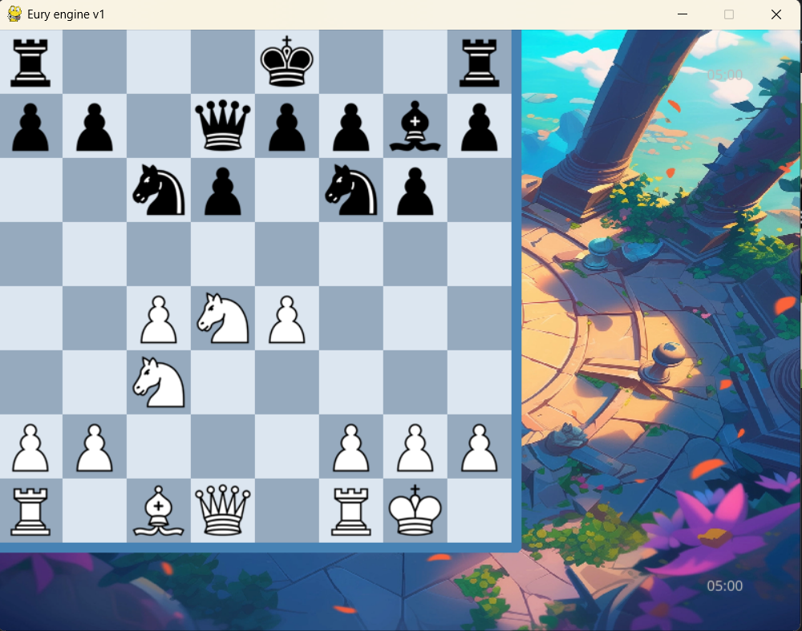
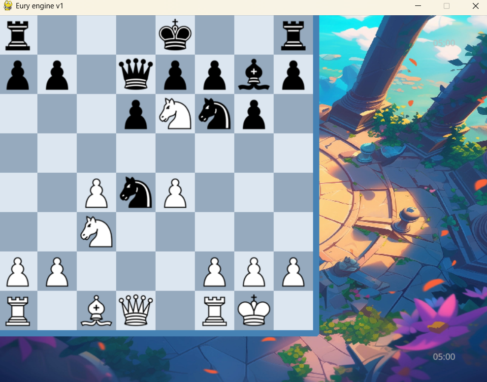

# chess-ai
Home UI

game UI

Opening with Sicilian
Đánh giá 3 nước đầu tốc độ nhanh

cumtime: 0.003

Sau nước thứ 4: Tốc độ chậm lại trễ 4s
-> Tính toán phức tạp khi không tìm thấy trong opening book 

cumtime: 4.761 

modular architecture design

